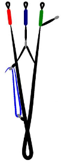
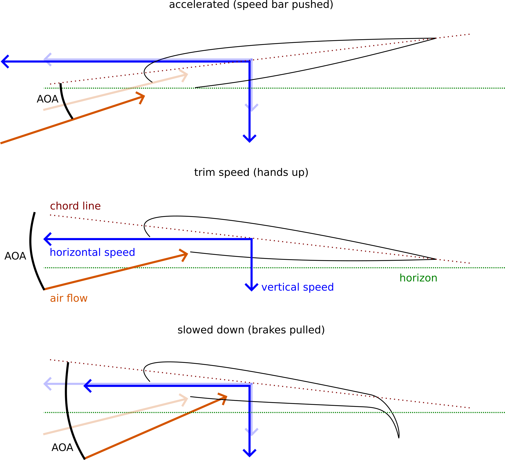
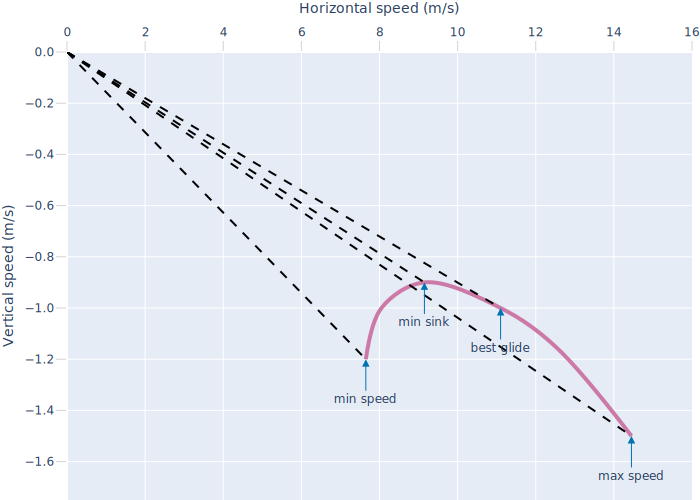
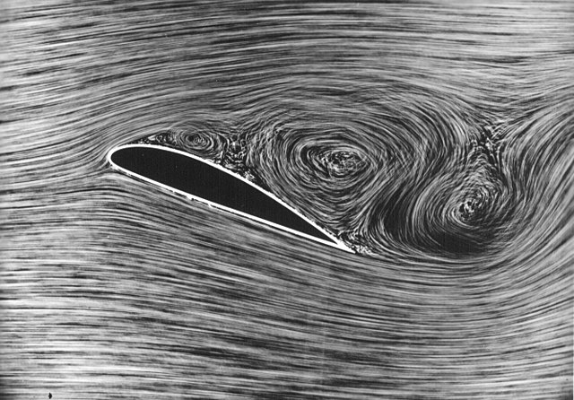
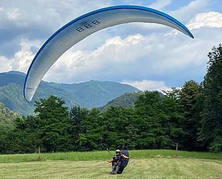

class: center, middle, gray-background

# Paragliding aerodynamics

## Radovan Bast

Text: CC-BY 4.0

---

## Goals

- Get a good .emph[practical overview]

- Not focus too much on why it flies but rather .emph[how we can change flying characteristics] -> this is important for safety

### Not a goal

- Technical and academic detail
- Recovery techniques in incidents (SIV courses)

### About me

- Flying since 2017
- PP4 (400 flights, 100 hours, 3 SIVs) at the time of writing this
- There are most probably mistakes - please point them out to me

---

class: center, middle, inverse

# Why and how does it fly?

---

.left-column50[
### Streamlines and velocity field

.cite[(c) John S. Denker, ["See How It Flies"](https://www.av8n.com/how/)]

- **laminar flow**: smooth, even, unhindered, non-mixing flow
- wing changes speed of air above and below wing
- velocity and pressure distribution depends on angle of attack
]

.right-column50[
### Upwash and downwash

.cite[(c) John S. Denker, ["See How It Flies"](https://www.av8n.com/how/)]

- downward momentum in air column behind the wing -> upward momentum on the wing
]

---

## Streamlines around a paraglider airfoil (simulated)

.cite[Becker, Sarah & Bruce, Paul. (2017). Experimental Study of Paraglider Aerodynamics. https://doi.org/10.13140/RG.2.2.33674.16321]

---

.left-column50[

.cite[(c) John S. Denker, ["See How It Flies"](https://www.av8n.com/how/)]
]

.right-column50[
### Airflow and pressure

- Bernoulli's principle
  - higher airspeed <-> lower pressure (suction; s)
  - lower airspeed <-> higher pressure (p)

- **pressure difference**: above and below

- airfoil does not have to be curved on top and flat on the bottom

- air passing above and below does not pass in equal time
]

---

class: center, middle, inverse

# What differences between airplanes and paragliders can you come up with?

---

## Differences with airplanes (1/2)

### Wing design

- wing is open in front: cell intakes
- arc (wing is not flat but curved)
- stability design
- wing is flexible/collapsible
- negative angle of attack makes wing collapse
- there is pressure inside the wing and it varies
- we can change the size of wing during flight (voluntarily or involuntarily)

### Controls

- different mechanisms to change angle of attack
- tail-less
- no rudder
- steering

---

## Differences with airplanes (2/2)

### "Fuselage"

- "fuselage" is 8 m below the wing: human is the pendulum
- connection between human and wing is not fixed (slack/tension): inverted flight not possible, nose-dive requires spiraling
- reducing wing loading can make wing collapse

### "Propulsion"

- thrust comes from gravity
- altitude is the fuel
- in straight and level flight, airflow typically comes at an angle from below, not from front

---

class: center, middle, inverse

# Which controls do we have on a paraglider?

---

## Which controls do we have on a paraglider?

.left-column50[

.cite[From "Nailing the basics of active flying" by Greg Hamerton in the Cross Country Magazine (February/March 2023, p. 36)]
]

.right-column50[
- **Brakes** (left, right, or both): induce drag -> yaw or pitch
- **Speed bar**: changes angle of attack
- **Weight shift**: creates a roll but then also some pitch and yaw
- **Back risers**
- We can **pull at some lines** and deform the wing (example: "big ears")

### Brake application

- Most pilots only use a small fraction of the entire **brake range**
- It's not only about brake position, but also about the timing
]

---

- Chord line: imaginary line through the front of leading adge and the trailing edge

- On a paraglider, angle between chord line and horizon is generally **not the angle of attack**

---

## Angle of attack (AOA)

- Angle between **air flow** and chord line

---

.cite[[Pilot’s Handbook of Aeronautical Knowledge, Chapter 5, Aerodynamics of Flight, FAA-H-8083-25B](https://www.faa.gov/regulations_policies/handbooks_manuals/aviation/phak/media/07_phak_ch5.pdf)]

- Data is for a specific airfoil (not a paraglider but it is still relevant)
- Increasing angle of attack (AOA) -> increasing lift (L) and increasing drag (D)
- At a certain AOA, this airfoil stalls
- There is an AOA with optimal glide (optimal L/D ratio)
- A paraglider is typically trimmed to fly close to optimal glide when hands-up
- On a paraglider we also want to avoid a too low AOA (more about it later)

---

## What affects lift?

- Speed: lift increases quadratically with speed

- AOA: lift increases linearly with AOA

- Wing area: lift increases linearly with the area

- Shape (airfoil)

- Aspect (indirectly)

---

class: center, middle, inverse

# How can we change the AOA on a paraglider?

---

## How can we change the AOA on a paraglider?

- speed bar

- brakes

- rear-riser control

- collapsing wing (voluntarily or involuntarily)

- turbulence

- aging of lines (A and B lines often lengthen with time, C and brake lines
  often shorten with time)

---

## Speed bar application pulls A and B lines down

.cite[Images from <https://www.korteldesign.com/en/reflexion-sur-laccelerateur/>]

- left: trim speed
- center: 50% speed bar (first step, legs extended)
- right: 100% speed bar (second step, legs extended, pullies almost touch)

---

## Brake application: not the opposite of pushing the speed bar

.left-column70[
  

  .cite[[R. Falquier, T. Lolies, U. Ringertz, Longitudinal Flight Mechanics of Paraglider Systems](https://www.diva-portal.org/smash/get/diva2:1359785/FULLTEXT01.pdf)]
]

.right-column30[
### Brake range

- No brake: hands fully up, trailing edge not deflected

- Full brake: hands fully down

- Beginners will typically not need the full brake range
]

---

- too high AOA: wing stalls
- too low AOA: wing deflates ("full frontal")

---

.cite[[Pilot’s Handbook of Aeronautical Knowledge, Chapter 5, Aerodynamics of Flight, FAA-H-8083-25B](https://www.faa.gov/regulations_policies/handbooks_manuals/aviation/phak/media/07_phak_ch5.pdf)]

- There is an airspeed with optimal glide (minimum drag)
- A paraglider is typically trimmed to fly close to minimal drag when hands-up (and no speed bar applied)

---

## Contributions to total drag

.cite[[Association of Paragliding Pilots and Instructors (APPI) Pilot Manual, Version 1.2](https://drive.google.com/file/d/1QmOzOG6EOmTa6XB0HruR98iBMa3GjzuX/view)]

- Wing-tip vortices (induced drag): they are a side effect of lift and produced
  by pressure difference (below and above the wing)

---

## Glide ratio

- glide ratio = distance / altitude loss

- typically ~ 10

- launching from 1000 m in still air, no lift or sink, how far can you glide?

- **glide ratio changes with speed** (brake application or speed bar)

- we always glide "down", even when thermalling (surrounding air then rises faster than we sink)

- sail planes can reach glide ratio of 50-60

---

## Glide polar curve

- polar curve: relation between horizontal speed and vertical speed
- horizontal speed (brake application or speed bar) and vertical speed are **not independent**

---

- slower than min speed: **stall**
- reducing A lines beyond max speed: frontal collapse
- **trim speed** ("hands up"): close to best glide, around 10 m/s (36 km/h)
- beginners on modern gliders: do not try to optimize sink with brake application
- min sink is not the same as optimal glide (max distance)
- note how we can read off the glide ratio when looking at the -1.0 m/s vertical speed line
- polar curve depends on how still the air is, altitude, harness, weight, position
- great video: [Andre Bandarra: Polar Curves - Basics](https://www.youtube.com/watch?v=LoTmNHhoQaA)

---

## Polar curves on different gliders

.cite[inspired by the article "Staying in touch" by Bastienne Wentzel in the Cross Country Magazine (October 2022, p. 34)]

- pushing speed bar increases speed (increases lift) but also reduces AOA (reduces lift)
- modern gliders and higher performance gliders compensate the two better
- high performance gliders are faster and less sinky at higher speed
- there has been a lot of progress in the last 10 years

---

## Flying against headwind

.left-column60[

]

.right-column40[
- polar moves to the left

- push speed bar for best glide

- we like a little bit of head wind to start

- shows why we don't want to fly in 10 m/s wind
]

---

## Flying with tailwind

.left-column60[

]

.right-column40[
- polar moves to the right

- hands up for best glide

- shows why we don't want to land in tailwind
]

---

## Flying in lifting air

.left-column60[

]

.right-column40[
- polar moves up

- hands up for best glide
]

---

## Flying in sinking air

.left-column60[

]

.right-column40[
- polar moves down

- push speed bar for best glide
]

---

## Effect of adding weight

.left-column60[

]

.right-column40[
- polar moves tangentially along the best glide

- glide is unchanged but speeds goes up (**also the stall speed**)

- adding a lot of weight might change shape which would change glide and flight
  characteristics
]

---

## Quiz: what happens when you add 10 kg weight?

- .quote[[ ] Your fly slower]

- .quote[[ ] Your fly faster]

- .quote[[ ] Glide becomes shorter (you land too short)]

- .quote[[ ] Stall speed goes up]

- .quote[[ ] In weak lift you climb less well]

- .quote[[ ] The certification of your glider is still the same]

---

## Forces on a paraglider

- Upward forces balance downward forces

---

## Turning with brakes and/or weightshift

(work in progress)

- **Weight shift**: creates a roll but then also some pitch and yaw; loads one side of the wing more and displaces center of lift
  from center of mass and creates a roll (which restores center of lift above center of mass)

---

## Forces in a turn

- Vertical component of lift is smaller
- Higher sink rate
- More Gs (you feel heavier)
- More wing loading
- The pendulum weight (pilot) swings faster around the turn

### What this means for landing

- Avoid steep turns close to ground
- Avoid turns on final approach before landing (sometimes a tree landing is
  better than a steep turn to force the glider onto the nice grass field)

---

## Flare authority

- Less speed -> less lift -> less flare authority
- More speed -> more lift -> more flare authority
- Landing at sea level -> more air density -> more flare authority
- Landing at high altitude -> less air density -> less flare authority

### What this means for landing

- You want speed on approach to have more control and possibly a softer landing
- When landing at high altitude, you need to be very precise with your flare timing

---

## Stall

.left-column40[
  

  .cite[DLR, CC-BY 3.0]
]

.right-column60[
- Airflow does not follow upper side of wing anymore
- Wing stops producing lift
- **Always at same AOA**
- Not always at the same speed: it is possible to stall a wing at any speed
- Not always at the same hand position
- On a paraglider a stall often deforms the wing
- Often wing tips "peel" first
- It can take surprisingly **much brake** to stall a wing from normal flight
- It takes surprisingly **little brake** to (re-)stall a wing which is not in normal flight
]

---

## Full stall

- Video: [J. Sanderson, "Stalls: SIV Paragliding Safety Training"](https://www.youtube.com/watch?v=2WxyEas7Jyk)
- Wing rocks back
- Brakes become soft
- Peels back from wingtips
- Highly sensitive and unstable
- Risks: twist, spiral, canopy contact

## Spin

- Video: [J. Sanderson, "Spins: Paragliding Safety"](https://www.youtube.com/watch?v=wfgpuj9uwmk)
- One brake becomes soft
- One side of the wing stalls
- Half wing flies forward, half wing backward
- Can be accidentally induced by very heavy brake with no or wrong weight shift
- Risks: twist, spiral

---

## Deep stall

.left-column50[

.cite[From [Paraglider Control: Stall, Spin, Collapse!](https://flybubble.com/blog/paraglider-control-stall-spin-collapse)]
]

.right-column50[
- Wing looks open but you experience huge sink (7 m/s)
- Very yaw-unstable
- **Waffle-grid pattern**: Lower surface sucked up against upper surface
- Line attachments look like being pulled out
- Wing becomes parachute
- Air flows from below
]

---

## What does this mean for beginners?

### **Beginners never** want stall/spin in flight

### **Later** in your flying career

- Stall/spin can be a useful tool to reset/ fix problems (learn during SIV)
- Acro: stall/spin are basic "every-day" elements

### You can try to stall/spin wing **on the ground** (ground handling or after landing)

- Observe how wing falls back
- However, it is not the same point and not the same pressure/feeling as in
  flight (on the ground the wing is not loaded)

.quote[Quiz: what is the advantage of wing falling back after landing instead of falling forward?]

---

## Roll/pitch/yaw stability

.left-column50[

.cite[From "Nailing the basics of active flying" by Greg Hamerton in the Cross Country Magazine (February/March 2023, p. 36)]
]

.right-column50[
- if wing is pitched/rolled/yawed away from equilibrium, it has the
  **tendency to return to equilibrium** (above your head)
- pilot is the weight on a long pendulum -> tendency to restore
- wing design supports stability (especially beginner wings)
- reduced stability if you reduce wing span (e.g. during "big
  ears" or "big big ears" maneuver)
- roll/pitch/yaw movements are typically coupled (it is however possible to do them
  separately: dolphining, spiral/looping, heli)
]

---

## Wing design and stability

- Sweep back: yaw stability

- Center of drag is behind center of lift: yaw stability

- Arc: stretches the front open

- Aspect ratio

- Line setup

- Increased drag when pitching: pitch stability

- Front collapse when over-pitching: avoid canopy contact

---

## Shape and internal pressure

### Shape maintained by ...

- Internal pressure
- Line attachments
- Line tension
- Positive AOA

### Internal pressure

- Wing has cell openings
- Pressure decreases progressively from front to back and from center to
  wingtips
- Brake input can briefly increase/restore internal pressure (like squeezing
  the end of toothpaste tube; "pumping out the deflation")

---

## Aspect ratio

.left-column40[

.cite[(c) [2018 JackieLou DL](https://pixabay.com/no/photos/paragliding-paraglider-gr%C3%B8nt-seil-3448982/)]

.cite[(c) 2020 Sebastian Schmied, CC-BY-SA-4.0]
]

.right-column60[
- aspect ratio = span*span / area
- you will never have to compute it, you can look it up for any wing
  ([example 1](https://flyozone.com/paragliders/products/gliders/buzz-z7/),
   [example 2](https://www.advance.swiss/en/products/paragliders/epsilon-dls))
- some example values for orientation:
  - school wings: 4.5 - 5
  - beginner: 5 - 5.5
  - intermediate: 5.5 - 6
  - advanced/sport: 6.5
  - competition: 7.5
- lower aspect: **rounder**, less performance, more stability/rigidity
- higher aspect: **thinner**, less induced drag, more performance (speed,
  better glide, better climb); less stability: more piloting needed to
  prevent deflations and cravats; more dynamic deflations
]

---

## Certification: A -> B -> C -> D -> CCC -> uncertified

### From A to D ...

- more speed
- more performance
- deflations more dynamic
- less stability
- more piloting needed in lively air and to fix problems

### Homework

- On <https://para-test.com/> find and read the test report for your glider and
  find out why it was rated A or B or C or ...

---

## Weight range

Weight range refers to **"all up" weight** (take-off weight)

.left-column60[

]

.right-column40[

]

- Flying outside the weight range? You might be outside of certification.
- Glider has been test flown on the lower and higher end of the weight range.
- Homework: Measure your "all up" weight (you and all the gear and clothes and
  everything) and compare with the weight range of your glider.

---

## Weight range

.left-column50[
### Being "light" on the glider

- Slower

- Easier to climb in weak lift

- Less wing loading

- Deflations more likely

- Deflations less dynamic
]

.right-column50[
### Being "heavy" on the glider

- Faster

- Worse climb in weak lift

- Higher wing loading and tension

- Deflations less likely

- Deflations more dynamic
]

---

## Wing loading

- Defined as weight / wing area

- Typically around 3.5 kg / m^2 (homework: figure out the wing loading for you on your wing)

- Acro wings: high wing loading (6 kg / m^2, or even more)

### More wing loading means ...

- More tension
- Higher speed
- Higher stall speed
- Same glide (unless wing distorts)
- More dynamic in turns
- More dynamic after deflations

---

## What modifies wing loading?

.quote[More weight or less wing]

- More weight (gear, body, different harness, extra ballast)

- Smaller wing

- Collapsed wing (can behave like a smaller wing)

- Broken lines

- More Gs during maneuvers (tight turn, spiral, acro maneuvers)

---

## Incidents and how they affect aerodynamics (1/2)

.quote[This is about the aerodynamics, not about SIV or recovery techniques!]

### Start and pre-flight checks

- Broken line: less maneuvering possibilities, wing structure can change
- Knot in lines: drag, wing turns towards the knot
- Line-over: maneuvering very limited, might not even fly
- Twisted start: less maneuvering possibilities, brakes are "opposite"
- Twisted brake lines: less maneuvering possibilities

---

## Incidents and how they affect aerodynamics (2/2)

### Lack of servicing

- Aging lines: AOA changes, brake range changes, difficult to launch, closer to stall/spin
- Too much porosity: bad glide, deep stall

### During flight

- Cravat (cloth caught in-between lines): huge drag, wing turns towards the cravat, rotation
- Deflation (symmetric, asymmetric): depends but often leads to rotation towards the deflation

---

## Trim

- Line attachments and line lengths determine the shape/camber/trim.

- Trim speed: speed when "hands up" (close to minimal drag)

- When a wing is out of trim:
  - "hands up" AOA changes
  - A and B lines often lengthen, C and brake lines often shorten over time
  - Wing can deform/stretch/shrink over time

- To trim a wing: bringing it back to trim by adjusting lines (often done by expert).
  **Check the trim when buying a second hand wing**.

- Check your wing at least every 2 years.
  It may not be enough to check line lengths alone (wing can deform/stretch/shrink).
