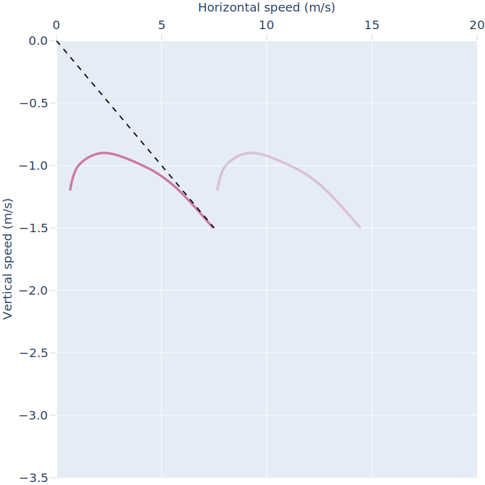
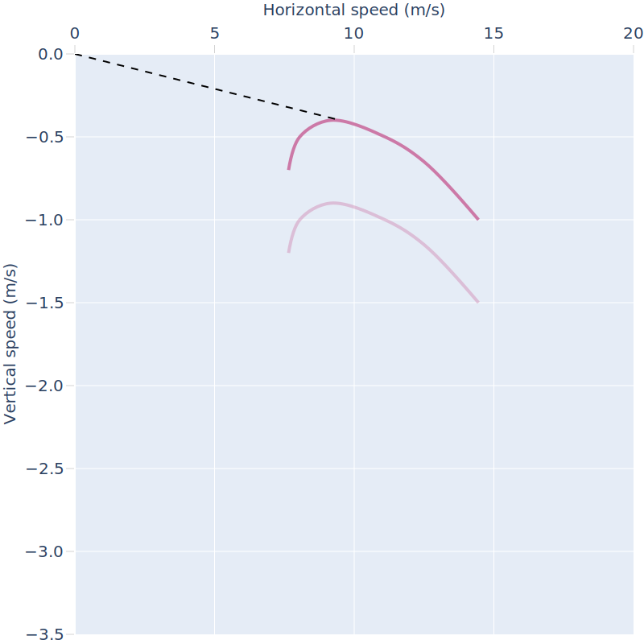

class: center, middle, gray-background

# Title

## Autor

Text: CC-BY 4.0

---

.left-column50[
### Streamlines and velocity field

.cite[(c) John S. Denker, ["See How It Flies"](https://www.av8n.com/how/)]
]

.right-column50[
### Upwash and downwash

.cite[(c) John S. Denker, ["See How It Flies"](https://www.av8n.com/how/)]
]

---

.left-column50[

.cite[(c) John S. Denker, ["See How It Flies"](https://www.av8n.com/how/)]
]

.right-column50[
### Airflow and pressure

(write me ...)
]

---

(streamlines in a ram air airfoil)

---

## Differences with airplanes

- wing is flexible/collapsible
- wing is open in front: cell intakes
- there is pressure inside the wing and it varies
- we can change the size of wing during the flight (voluntarily or involuntarily)
- "fuselage" is 8 m below the wing: human is the pendulum
- reducing wing loading can make wing collapse
- connection between human and wing is not fixed (slack/tension): inverted flight not possible, nose-dive requires spiraling
- thrust comes from gravity
- altitude is the fuel
- airflow typically comes from below, not from front
- dome/arc/camber
- stability design
- different mechanism to change angle of attack
- steering

---

.cite[[Pilot’s Handbook of Aeronautical Knowledge, Chapter 5, Aerodynamics of Flight, FAA-H-8083-25B](https://www.faa.gov/regulations_policies/handbooks_manuals/aviation/phak/media/07_phak_ch5.pdf)]

- Data is for a specific airfoil
- Increasing angle of attack (AOA) -> increasing drag and increasing lift
- There is an AOA with optimal glide (optimal L/D ratio)
- A paraglider is typically trimmed to fly close to optimal glide when hands-up
- At a certain AOA, this airfoil stalls

---

.cite[[Pilot’s Handbook of Aeronautical Knowledge, Chapter 5, Aerodynamics of Flight, FAA-H-8083-25B](https://www.faa.gov/regulations_policies/handbooks_manuals/aviation/phak/media/07_phak_ch5.pdf)]

- There is an airspeed with optimal glide (minimum drag)
- A paraglider is typically trimmed to fly close to minimal drag when hands-up (and no speed bar applied)

---

(composition of drag: lines, harness, wing, ...)

---

## Brake application

.cite[[R. Falquier, T. Lolies, U. Ringertz, Longitudinal Flight Mechanics of Paraglider Systems](https://www.diva-portal.org/smash/get/diva2:1359785/FULLTEXT01.pdf)]

---

## Glide ratio

(add image)

- glide ratio = distance / altitude loss
- typically ~ 10
- launching from 1000 m in still air, no lift or sink, how far can you glide?
- **glide ratio changes with speed** (brake application or speed bar)
- we always glide "down", even when thermalling (surrounding air then rises faster than we sink)
- sail planes can reach glide ratio of 50-60

---

## Glide polar curve

- polar curve: relation between horizontal speed and vertical speed
- horizontal speed (brake application or speed bar) and vertical speed are **not independent**

---

- slower than min speed: stall!
- reducing A lines beyond max speed: frontal collapse
- trim speed is close to best glide ("hands up")
- beginners on modern gliders: do not try to optimize sink with brake application
- min sink is not the same as optimal glide (max distance)
- note how we can read off the glide ratio when looking at the -1.0 m/s vertical speed line
- polar curve depends on how still the air is, altitude, harness, weight, position
- great video: [Andre Bandarra: Polar Curves - Basics](https://www.youtube.com/watch?v=LoTmNHhoQaA)

---

## Polar curves on different gliders

.cite[inspired by the article "Staying in touch" by Bastienne Wentzel in the Cross Country Magazine (October 2022, p. 34)]

- pushing speed bar increases speed (increases lit) but also reduces AOA (reduces lift)
- modern gliders and higher performance gliders compensate the two better
- high performance gliders are faster and less sinky at higher speed
- there has been a lot of progress in the last 10 years

---

## Flying against headwind

- push speed bar for best glide

---

## Flying with tailwind

- hands up for best glide

---

## Flying in lifting air

- hands up for best glide

---

## Flying in sinking air

- push speed bar for best glide

---

## Effect of adding weight

- glide is unchanged but speeds goes up (also the stall speed)
- adding a lot of weight might change shape which would change glide

---

## Roll/pitch/yaw stability

.left-column50[

.cite[From "Nailing the basics of active flying" by Greg Hamerton in the Cross Country Magazine (February/March 2023, p. 36)]
]

.right-column50[
- if wing is pitched/rolled/yawed away from equilibrium, it has the
  **tendency to return to equilibrium** (above your head)
- pilot is the weight on a long pendulum -> tendency to restore
- wing design supports stability (especially beginner wings)
- you will notice reduced stability if you reduce wing span (e.g. during "big
  ears" or "big big ears" maneuver)
- roll/pitch/yaw movements are typically coupled (it is however possible to do them
  separately: dolphining, spiral/looping, heli)
]
